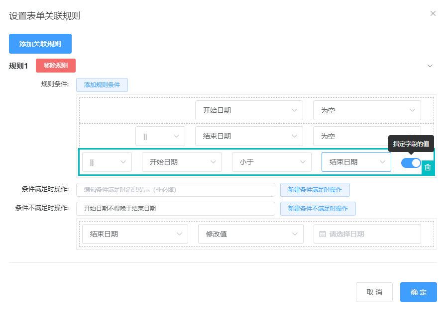

### FieldCorrelativeRules
配置字段之间的关联规则

> 在表单中，因为项目的业务需求，各个字段产生各种关联关系。常见的关联关系如下：
> + `下拉单选/单项选择` 选择某一项，修改另一个字段的 **值**
> + `下拉单选/单项选择` 选择某一项，控制另一个字段的 **显示/隐藏**
> + `下拉单选/单项选择` 选择某一项，修改另一个含选项字段的 **选项列表**
> + 填报了多了个字段时，经过条件判断，触发某种 **消息提醒**

### Rule Obj
规则对象的完整属性如下：

| 名称 | 说明 | 类型 |
| - | - | - |
| key | 规则的唯一值 | String |
| conditions | 规则的判断条件数组，**条件对象详细如下表** | Array |
| T_message | 条件满足时的消息提示 | String |
| F_message | 条件满足时的消息提示 | String |
| T_handle | 条件满足时的执行动作数组，**动作对象详细如下表** | Array |
| F_handle | 条件不满足时的执行动作数组，**动作对象详细如下表** | Array |

### Condition Obj
条件对象的完整属性如下：

| 名称 | 说明 | 类型 | 可选值 | 默认值 |
| - | - | - | - | - |
| key | 条件的唯一值 | String | - | - |
| type | 条件类型 | String | condition 条件 / connector 连接符 | condition |
| connector | 连接符 | String | - | - |
| fieldName | 条件关联的字段name | String | - | - |
| fieldType | 条件关联的字段类型 | String | - | - |
| valueType | 条件关联的字段value的类型 | String | - | - |
| judge | 条件判断语句, **详细见下表** | String | - | - |
| value | 条件判断的值 | String | - | - |
| isCompareField | 与表单内的替他字段进行对比 | Number | - | - |
| compareFieldName | 用于条件对比的字段的name | String | - | - |

#### Judge
**字段可选的条件判断语句完全是根据字段的 value 类型，来展示对应的判断语句选项**

| 名称 | 说明 | 通用类型 |
| - | - | - |
| == | 等于 | String, Boolean, Number |
| != | 不等于 | String, Boolean, Number |
| contains | 包含 | Array |
| uncontains | 不包含 | Array |
| nullStr | 为空 | String, Number |
| unnullStr | 不为空 | String, Number |
| nullArr | 数组为空 | Array |
| unnullArr | 数组不为空 | Array |
| > | 大于 | Number |
| < | 小于 | Number |
| >= | 大于等于 | Number |
| <= | 小于等于 | Number |

### Handle Obj
动作对象的完整属性如下：

| 名称 | 说明 | 类型 | 可选值 | 默认值 |
| - | - | - | - | - |
| key | 条件的唯一值 | String | - | - |
| type | 动作类型 | String | C_value 修改值 / C_show 显示隐藏 / C_options 修改选项列表 | - |
| fieldName | 动作关联的字段name | String | - | - |
| fieldType | 动作关联的字段类型 | String | - | - |
| valueType | 动作关联的字段value的类型 | String | - | - |
| value | 满足条件时，修改字段的值 | String | - | - |
| show | 满足条件时，控制字段的显示隐藏 | Boolean | - | true |
| options | 满足条件时，控制字段的选项列表 | Array | - | [] |