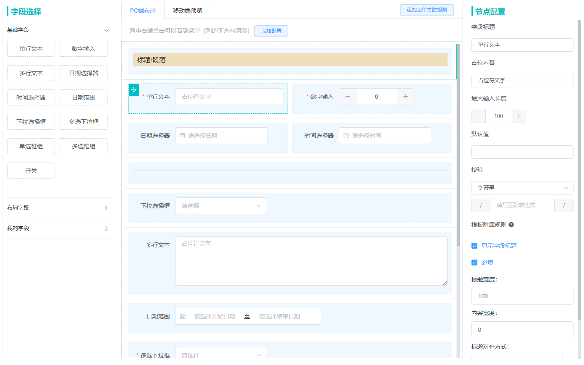

## 创建表单组件
本节将介绍如何在项目中使用 SmartFormCreate 组件



### 使用组件
``` html
<smart-form-create></smart-form-create>
```

### Attributes
| 参数 | 说明 | 类型 | 可选值 | 默认值 |
| -- | -- | -- | -- | -- |
| layout | 布局方式 | String | default: 自定义布局；single：单字段布局 | default |
| showOriginFields | 选择展示组件提供的基础字段 | Array | base： 基础字段；layout：布局字段 | ['base', 'high', 'layout'] |
| extendedAttrs | 字段扩展属性的对象集合 | Object | -- | {} |
| prefixName | 自定义字段唯一值 name 前缀 | String | -- | 字段的type |
| customAttrs | 自定义的组件参数对象, **详细参数见下表** | Object | -- | -- |

#### CustomAttrs 内置的自定义属性
| 参数 | 说明 | 类型 | 可选值 | 默认值 |
| -- | -- | -- | -- | -- |
| dictionaryArr | 含选项的字段可绑定的字典的数组对象，`Dictionary Object` **详细参数见下表** | Array | -- | [] |
| loadDictList | 获取字典项的操作函数，返回一个Promise，数据在 reslove 中传递，`Dict Data Object` **参数见下表** | Function | -- | null |

#### formData
| 参数 | 说明 | 类型 |
| -- | -- | -- |
| form | 表单字段集合 | Array |
| layout | 布局数据对象 | Object |
| attachedRule | 表单附属规则集合 | Object |

#### Dictionary Object Attributes
| 参数 | 说明 | 类型 | 可选值 | 默认值 |
| -- | -- | -- | -- | -- |
| dictName | 字典名称 | String | -- | -- |
| constantId | 字典唯一键 | String | -- | -- |

#### Dict Data Object Attributes
| 参数 | 说明 | 类型 | 可选值 | 默认值 |
| -- | -- | -- | -- | -- |
| value | 字典项名称 | String | -- | -- |
| key | 字典项唯一键 | String | -- | -- |

### Methods
| 方法名 | 说明 | 参数 |
| -- | -- | -- |
| getCustomFormData | 获取当前表单数据，返回一个 Promise | -- |
| initFormData | 初始化表单数据，通常在编辑时使用。接受一个参数为表单数据对象 formData | Function(formData: Object) |

### Slot
**支持为字段自定义各种具名插槽，内置的具名插槽如下**

| 方法名 | 说明 | 参数 |
| -- | -- | -- |
| tag | 字段的标签插槽 | field 对象 |
