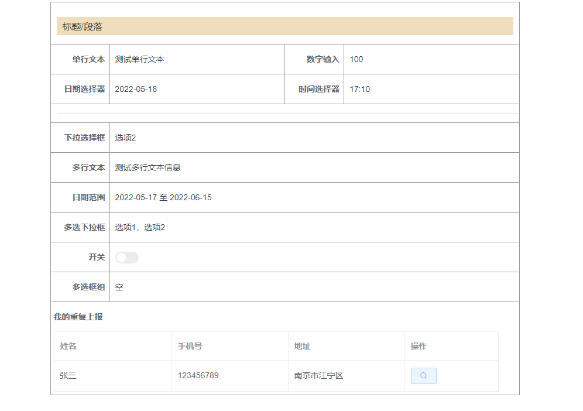

## 表单详情组件
本节将介绍如何在项目中使用 SmartFormShow 组件



### 使用组件
``` html
<smart-form-show ref="showForm" :form-data="formData" :report-data="reportData">
</smart-form-show>
```

### Attributes
| 参数 | 说明 | 类型 | 可选值 | 默认值 |
| -- | -- | -- | -- | -- |
| formId | 表单的唯一键 | String | -- | Date.now().toString() |
| formData | 表单数据对象，`formData` **参数见下表** | Object | -- | -- |
| reportData | 上报过的表单数据，通常在编辑时使用 | Object | -- | {} |
| isFieldShow | 自定义字段是否展示，应返回一个布尔值 | Function | -- | -- |
| customAttrs | 自定义的组件参数对象, **详细参数见下表** | Object | -- | -- |

#### formData
| 参数 | 说明 | 类型 |
| -- | -- | -- |
| form | 表单字段集合 | Array |
| layout | 布局数据对象 | Object |
| attachedRule | 表单附属规则集合 | Object |

#### CustomAttrs 内置的自定义属性
| 参数 | 说明 | 类型 | 可选值 | 默认值 |
| -- | -- | -- | -- | -- |
| loadDictList | 获取字典项的操作函数，返回一个Promise，数据在 reslove 中传递，`Dict Data Object` **参数见下表** | Function | -- | null |

#### Dict Data Object Attributes
| 参数 | 说明 | 类型 | 可选值 | 默认值 |
| -- | -- | -- | -- | -- |
| value | 字典项名称 | String | -- | -- |
| key | 字典项唯一键 | String | -- | -- |

### Methods
| 方法名 | 说明 | 参数 |
| -- | -- | -- |
| initShowForm | 初始化详情表单 | -- |

### Slot
**支持为字段自定义各种具名插槽，内置的具名插槽如下**

| 方法名 | 说明 | 参数 |
| -- | -- | -- |
| tag | 字段的标签插槽 | field 对象 |
| table-tag | 明细字表的行标签插槽 | { field, rowData } |