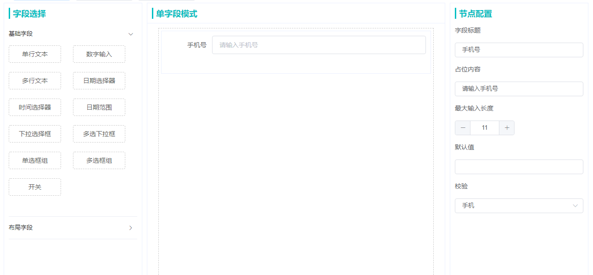
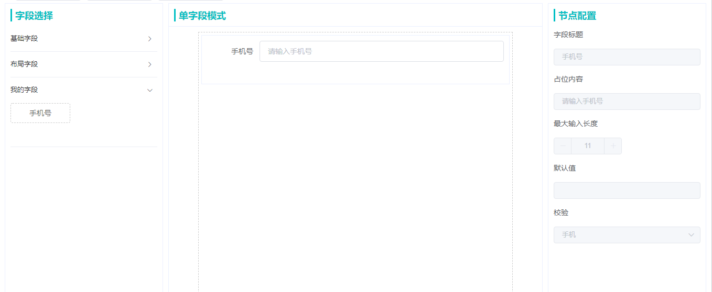
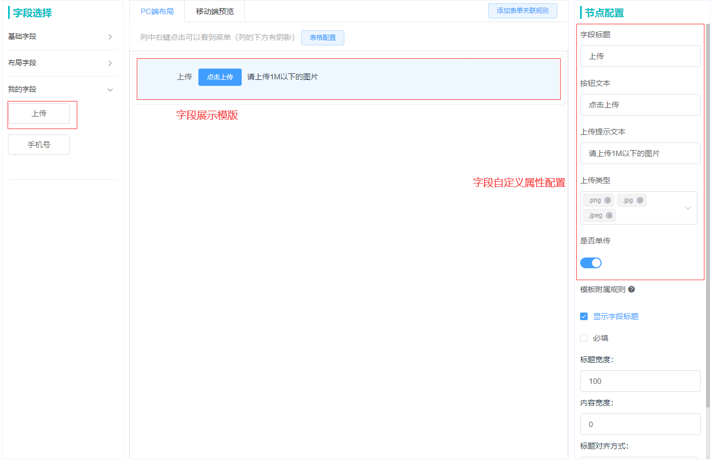
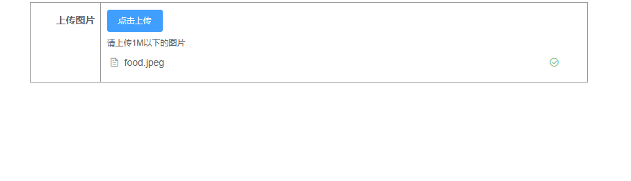
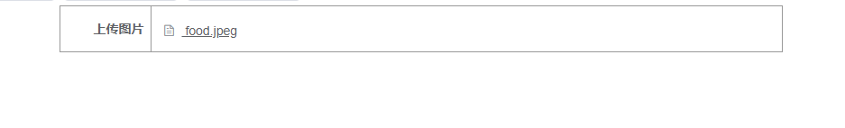

### 注册字段
通过 `SmartForm.registerFields()` 方法，可以为表单注册字段组件。
> registerFields 接受一个数组参数，表示注册的字段分组。注册的字段将在新的分组下展示

### 注册一个现有类型的字段
我们可以在 `SmartFormCreate` 的 `singleField` 模式下编辑字段，将编辑好的字段数据直接导出。数据如下：



``` javascript
{
  "name": "input_field_1656407314156810",
  "type": "input",
  "label": "手机号",
  "value": "",
  "configurable": true,
  "isFormField": true,
  "attrs": {
    "placeholder": "请输入手机号",
    "maxlength": 11,
    "dataType": "phone",
    "pattern": ""
  }
}
```
### RegisterFields

修改字段的 `configurable` 属性为 false，是它成为一个固定字段不可修改

``` javascript
SmartForm.registerFields([{
  groupName: '我的字段',
  groupKey: 'myFields',
  components: [
    {
      field: {
        "name": "input_field_1656407314156810",
        "type": "input",
        "label": "手机号",
        "value": "",
        "configurable": false,
        "isFormField": true,
        "attrs": {
          "placeholder": "请输入手机号",
          "maxlength": 11,
          "dataType": "phone",
          "pattern": ""
        }
      }
    }
  ]
}])
```




### 注册一个新类型的字段
一个全新类型的字段的完整属性结构如下：

| 名称 | 描述 | 类型 |
| - | - | - |
| configComponent | 字段的属性配置组件，用于表单创建时的属性配置使用，[ConfigComponent 详细](/doc/configComponent) | Component |
| templateComponent | 字段的模版组件，用于表单创建时展示的模板使用，[TemplateComponent 详细](/doc/templateComponent) | Component |
| detailComponent | 字段的详情展示组件，用于表单详情使用，[DetailComponent 详细](/doc/detailComponent) | Component |
| reportComponent | 字段的上报展示组件，用于表单上报使用，[ReportComponent 详细](/doc/reportComponent) | Component |
| attachedRule | 字段的附属规则计算函数，[AttachedRule 详细](/doc/field#AttachedRule字段的附属规则计算) | Function(required, label) |
| correlativeRule | 字段的关联规则判断条件计算函数，[CorrelativeRule 详细](/doc/field#CorrelativeRule字段的关联规则计算) | Function(value, judge, fieldName) |
| field | 字段自身的相关属性，[Field 详细](/doc/field) | Object |

> 当业务需要封装一个全新类型的字段时，需要开发者自己封装字段需要的业务组件。<br>
> 再使用 `registerFields`
> 方法进行表单注册

### 注册一个上传字段
1. 在个人项目中 `components` 目录下创建 `Uploader` 组件目录
+ components
  + Uploader
    + config.vue // 配置组件
    + detail.vue // 详情组件
    + report.vue // 上报组件
    + template.vue // 模版组件
    + index.js 
2. 在 `index.js` 中导出字段配置对象，在 `main.js` 中引入并注册

``` javascript
// index.js
import configComponent from './config'
import detailComponent from './detail'
import reportComponent from './report'
import templateComponent from './template'

export default {
  configComponent,
  detailComponent,
  reportComponent,
  templateComponent,
  attachedRule(required, label) {
    return {
      required,
      message: `请上传${label}`,
      trigger: 'change'
    }
  },
  correlativeRule(condition) {
    return ''
  },
  field: {
    type: 'uploader', // 字段类型
    label: '上传', // 字段名称
    value: [], // 字段的默认值
    configurable: true, // 属性是否可配置
    isFormField: true, // 是否是表单字段
    attrs: { // 字段的自定义配置属性
      btnText: '点击上传',
      tips: '请上传1M以下的图片',
      accept: ['.png', '.jpg', '.jpeg'],
      multiple: false
    }
  }
}
```
``` JavaScript
// main.js
import Uploader from './components/Uploader'

SmartForm.registerFields([{
  groupName: '我的字段',
  groupKey: 'myFields',
  components: [
    Uploader
  ]
}])
```
3. 在 `template.vue` 中编写上传模版组件，[TemplateComponent 详细](/doc/templateComponent)

``` vue
<template>
  <div class='uploader-template'>
    <el-upload>
      <el-button size="small" type="primary">{{attrs.btnText}}</el-button>
      <div slot="tip" class="el-upload__tip">{{attrs.tips}}</div>
    </el-upload>
  </div>
<template>

<script>
export default {
  name: 'uploader-template',
  props: {
    fieldObj: {
      type: Object,
      required: true
    }
  },
  computed: {
    attrs() {
      return this.fieldObj.attrs
    }
  }
}
</script>

<style scoped>
  .el-upload__tip {
    font-size: 12px;
    color: #606266;
    margin-top: 7px;
  }
</style>
```

4. 在 `config.vue` 中编写上传配置组件，[ConfigComponent 详细](/doc/configComponent)

``` vue
<template>
  <el-form :model='form' ref='form' label-position="top">
    <el-form-item label="字段标题">
      <el-input v-model="form.label" :disabled="disabled"></el-input>
    </el-form-item>
    <el-form-item label='按钮文本' prop='btnText'>
      <el-input v-model='form.attrs.btnText' :disabled="disabled"></el-input>
    </el-form-item>
    <el-form-item label='上传提示文本' prop='tips'>
      <el-input v-model='form.attrs.tips' :disabled="disabled"></el-input>
    </el-form-item>
    <el-form-item label='上传类型' prop='accept'>
      <el-select v-model="form.attrs.accept" multiple placeholder="请选择" :disabled="disabled">
        <el-option
          v-for="item in acceptOpt"
          :key="item"
          :label="item"
          :value="item">
        </el-option>
      </el-select>
    </el-form-item>
    <el-form-item label='是否单传' prop='multiple'>
      <el-switch
        v-model="form.attrs.multiple"
        :active-value="false"
        :inactive-value="true" :disabled="disabled">
      </el-switch>
    </el-form-item>
  </el-form>
</template>

<script>
export default {
  name: 'uploader-config',
  props: {
    form: {
      type: Object
    },
    disabled: {
      type: Boolean,
      default: false
    }
  },
  data() {
    return {
      acceptOpt: ['.png', '.jpg', '.jpeg', '.gif', '.bmp', '.psd', '.mp4', '.rmvb', '.mkv', '.wmv', '.flv', '.doc', '.docx', '.xls', '.xlsx', '.ppt', '.pptx', '.pdf', '.txt', '.tif', '.tiff', '.zip', '.rar', '.7z', '.mp3', '.avi', '.wps', '.asf', '.rm', '.mov', '.wav', '.ogg']
    }
  }
}
</script>

<style scoped>
.el-form {
  padding: 0 10px;
}
.el-form >>> .el-form-item__label {
  padding: 0;
}
.el-form-item {
  margin-bottom: 10px;
}
</style>
```

> **做好以上4步，就可以在创建表单的组件中拖拽使用我们的上传字段了**<br />
> 

5. 在 `report.vue` 中编写上传上报组件，[ReportComponent 详细](/doc/reportComponent)

``` vue
<template>
  <el-upload class='uploader-report' :style="reportStyle"
    :multiple="!attrs.multiple"
    :accept="acceptFiles"
    action="https://jsonplaceholder.typicode.com/posts/"
    :file-list="fieldObj.value">
    <el-button size="small" type="primary">{{attrs.btnText}}</el-button>
    <div slot="tip" class="el-upload__tip">{{attrs.tips}}</div>
  </el-upload>
</template>

<script>
export default {
  name: 'uploader-report',
  props: {
    fieldObj: {
      type: Object,
      required: true
    },
    reportStyle: {
      type: Object,
      required: true
    }
  },
  data() {
    return {
    }
  },
  computed: {
    attrs() {
      return this.fieldObj.attrs
    },
    acceptFiles() {
      return this.attrs.accept.join(',')
    }
  }
}
</script>

<style scoped>
.uploader-report {
  margin-bottom: 10px;
}
.el-upload__tip {
  font-size: 12px;
  color: #606266;
  margin-top: 7px;
  line-height: 1;
}
</style>
```

> 

6. 在 `detail.vue` 中编写上传详情组件，[DetailComponent 详细](/doc/detailComponent)

``` vue
<template>
  <ul class="el-upload-list el-upload-list--text" :style="reportStyle">
    <li class="el-upload-list__item is-success"
      v-for="(item, index) in fieldObj.value"
      :key="index">
      <a class="el-upload-list__item-name" :href="item.url" target="_blank">
        <i class="el-icon-document"></i>
        {{item.name}}
      </a>
    </li>
  </ul>
</template>

<script>
export default {
  name: 'uploader-detail',
  props: {
    fieldObj: {
      type: Object,
      required: true
    },
    reportStyle: {
      type: Object,
      required: true
    }
  }
}
</script>
```

> 